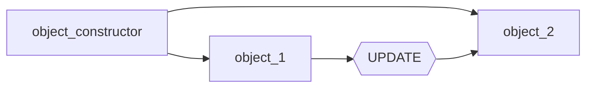

# **Reactive Programming**
Magma is built on the reactive programming principles, as such, you need to know what exactly is reactive programming, so that you can leverage Magma's features to it's best. 
_______
## **It's all about Events**
In Reactive Programming, you manage data with events, an event is simply enough, a notification that implies ***something has changed*** from an object to another, no matter their type.

Consider the following pseudocode:

```Lua

object_1 = object(23)
object_2 = object((object_1 / 2))

object_1:set(4) -- -> {
    this sends an notification to object_2 saying that it changed
}

print(object_2:get()) -- 2 
```

If we were to translate this to a diagram, it would look like:


________

## **Worry about data, not updates**
The beauty about reactive programming, especially when used in Magma, is that you shouldn't worry about updating your variables when their dependencies update. consider the following lua code:

```Lua

local var_1 = 24
local var_2 = var_1 * 2
```

This would only work once, because if you were to update var_1, you would manually need to update var_2 too. This is easy to fix in this example, but in larger codebases, it is very tedious to fix.
_______


In  this page, you were introduced to Reactive programming, a paradigm that let's you declare how your variables react to each other.